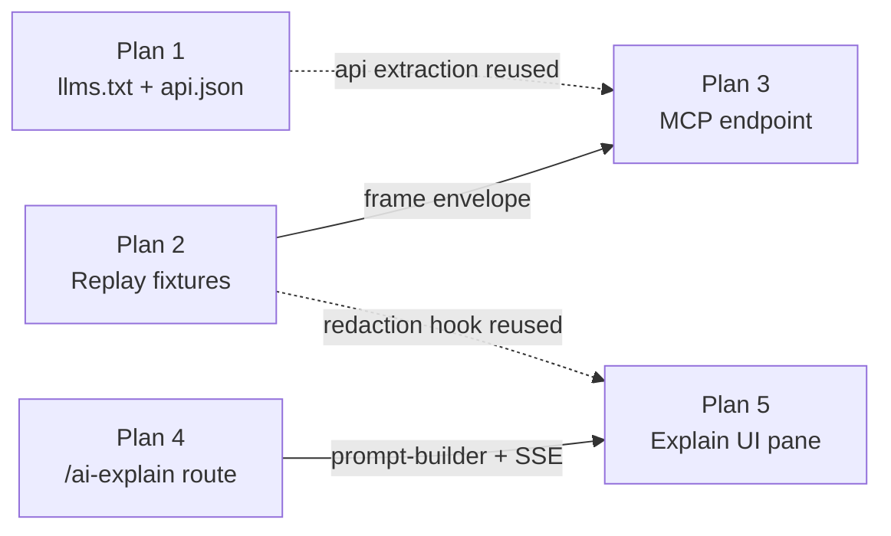

# NgRx DevTool — Agent-Era Roadmap


## Direction

NgRx DevTool should evolve from a UI-first debugger into an **API-first source of runtime truth** for humans and AI coding agents.

- The durable value is fidelity to NgRx semantics (actions, reducer transitions, effect lifecycles, selector/perf signals), not chart styling.
- The UI stays useful for humans, but the protocol is the primary surface for agents.
- Recordings become reproducible artifacts that can be replayed in CI and attached to automated debugging flows.
- The moat is grounded, framework-aware truth that generic LLMs cannot hallucinate around. The hedge against NgRx baking in native telemetry is to be the reference implementation: open protocol, easy to embed, neutral about which agent or IDE consumes it.

### Non-goals
- Reinventing Redux DevTools' time-travel UI. We borrow ideas, but the priority is machine-readable fidelity, not UI parity.
- Hosting a managed cloud service. The tool runs locally; recordings are portable artifacts.
- Shipping an opinionated LLM provider. Anything AI-facing must be BYO key / BYO provider.

### Protocol contract expectations
- Stable event envelope for action/state/effect/perf frames (`version`, `frameId`, `kind`, `timestamp`, `payload`, `contentHash`).
- Deterministic frame IDs and content hashing for precise references from agents (e.g. "look at frame `f_0142`").
- Versioned compatibility rules for agent/client consumers (semver on the envelope; additive changes only within a major).
- Replay fixture format documented and test-covered, with a JSON Schema published alongside the docs.

### Cross-cutting principles
- **Local-first.** No network calls unless the user explicitly opts in.
- **Zero secrets in artifacts.** Recordings and exports must be redaction-friendly.
- **Test the contract, not the UI.** Every protocol/fixture change ships with Jest coverage in [projects/ngrx-devtool/](projects/ngrx-devtool).
- **Docs are part of the feature.** A plan is not done until [docs/](docs) is updated.

> Plans are listed in execution order. Each builds on the ones before it.

---

## Plan 1 — [Feature]: Publish `llms.txt` and structured API manifest for AI agents
**Issue template:** `feature_request.yml` — Component: `Documentation`
**Labels:** `documentation`, `enhancement`
**Branch:** `docs/llms-manifest`
**Owner area:** [docs/static/](docs/static), [README.md](README.md)
**Resolves / depends on:** new — no existing upstream issue.

Add an [`llms.txt`](https://llmstxt.org/) at the docs site root plus a JSON manifest describing `provideNgrxDevTool` options so coding agents configure the library correctly first try.

**Why first:** cheapest to ship, unblocks agents immediately, and surfaces gaps in the public API surface before later plans depend on it. Nothing in Plans 2–5 depends on it shipping, but the API extraction pipeline introduced here is reused by Plan 3's MCP tool descriptions.

### Problem Statement
Coding agents and LLM-driven tools trying to integrate ngrx-devtool today must read scattered markdown docs and the TypeScript public API to figure out how to call `provideNgrxDevTool`. They frequently hallucinate option names or omit required setup. There is no machine-readable manifest of the public API, and no `llms.txt` pointing agents at canonical docs.

### Scope
- Generate `llms.txt` from the existing docs structure: one section per top-level docs folder, each linking to the canonical markdown.
- Generate `api.json` from the public API in [projects/ngrx-devtool/src/public-api.ts](projects/ngrx-devtool/src/public-api.ts) — option names, types, defaults, and a one-line description.
- Wire generation into the docs build so it can't drift.

### Implementation steps
1. Add a `scripts/generate-llms-manifest.ts` runner that:
   - Walks [docs/docs/](docs/docs) and emits an `llms.txt` grouped by top-level folder (`Getting Started`, `Features`, `Troubleshooting`, etc.) with absolute URLs derived from `docusaurus.config.ts`.
   - Uses `ts-morph` to parse [projects/ngrx-devtool/src/public-api.ts](projects/ngrx-devtool/src/public-api.ts) and re-export targets, collecting every exported symbol's name, kind (function/class/interface), parameter types, default values, and TSDoc summary.
   - Emits `docs/static/api.json` conforming to a sibling `docs/static/api.schema.json`.
2. Add an `npm run docs:manifest` script and call it from the docs build (`docs/package.json` `build`).
3. Add a CI guard: `npm run docs:manifest -- --check` re-runs generation into a temp dir and `diff`s against the committed files; non-zero diff fails CI.
4. Cross-link from [README.md](README.md), [npm-readme.md](npm-readme.md), and a new "For AI agents" callout in [docs/docs/getting-started/installation.md](docs/docs/getting-started/installation.md).

### Manifest shape (`api.json` v1)
```jsonc
{
  "version": 1,
  "generatedAt": "2026-05-26T00:00:00Z",
  "entries": [
    {
      "name": "provideNgrxDevTool",
      "kind": "function",
      "summary": "Registers the DevTool providers in an Angular app.",
      "params": [
        { "name": "options", "type": "NgrxDevToolOptions", "optional": true }
      ],
      "options": [
        { "name": "websocketUrl", "type": "string", "default": "ws://localhost:4000" }
      ]
    }
  ]
}
```

### Alternatives Considered
- Hand-maintain `api.json` parallel to the public API. Rejected: drift is inevitable; `ts-morph` extraction keeps the manifest authoritative.
- Rely on TypeDoc's HTML output for agents. Rejected: HTML is harder for models to parse cleanly than a typed JSON contract.
- Ship only `llms.txt` and skip `api.json`. Rejected: `llms.txt` covers prose docs but not parameter shapes — the manifest is what agents actually need to write correct call sites.

### Public API & dependencies
- No library exports change; this is a docs/tooling plan.
- New scripts: `scripts/generate-llms-manifest.ts`, plus npm scripts `docs:manifest` and `docs:manifest:check`.
- New devDependencies: `ts-morph` (TS AST traversal), `ajv` + `ajv-formats` (JSON Schema validation in CI).
- New static assets served by Docusaurus: `docs/static/llms.txt`, `docs/static/api.json`, `docs/static/api.schema.json`.

### Example usage (agent POV)
```bash
# Discover canonical entry points
curl https://amadeusitgroup.github.io/ngrx-devtool/llms.txt

# Look up a specific option shape
curl -s https://amadeusitgroup.github.io/ngrx-devtool/api.json \
  | jq '.entries[] | select(.name=="provideNgrxDevTool") | .options'
```

### Testing & docs deliverables
- Snapshot test against a fixture `public-api.ts` under `scripts/__tests__/` to lock extractor output.
- Schema validation test: `api.json` validates against `api.schema.json` in CI via `ajv`.
- New "For AI agents" callout in [docs/docs/getting-started/installation.md](docs/docs/getting-started/installation.md) linking both files.
- Cross-links added to [README.md](README.md) and [npm-readme.md](npm-readme.md).

### Rollout & compatibility
- Pure additive; no runtime impact on library consumers.
- `api.json.version: 1` — additive changes only within v1. Breaking shape changes bump to v2 and both files are served in parallel for at least one minor release.
- CI drift check (`docs:manifest:check`) is the contract that keeps the manifest authoritative.

### Acceptance criteria
- [ ] `docs/static/llms.txt` published at site root.
- [ ] `docs/static/api.json` with typed option schema (validated against a JSON Schema in CI).
- [ ] `docs/static/api.schema.json` published alongside.
- [ ] Linked from [README.md](README.md) and [npm-readme.md](npm-readme.md).
- [ ] Generation script runs in CI and fails the build on drift.
- [ ] Generation has unit-test coverage for at least one fixture public-api file (snapshot test).

### Open questions / risks
- Source of truth for `api.json`: prefer extracting from TS types via `ts-morph` over hand-maintaining a parallel file.
- Re-exports (`export * from './lib/core'`) require traversing barrel files; document the traversal limit (depth 3) to avoid runaway parsing.
- `llms.txt` URL base must respect the deployed docs origin, not `localhost:3000`; read it from `docusaurus.config.ts` `url` + `baseUrl`.

---

## Plan 2 — [Feature]: Record & export action sequences as replayable Jest fixtures
**Issue template:** `feature_request.yml` — Component: `ngrx-devtool-ui (dashboard)`
**Labels:** `enhancement`
**Branch:** `feat/replay-fixtures`
**Owner area:** [projects/ngrx-devtool-ui/src/components/](projects/ngrx-devtool-ui/src/components), [projects/ngrx-devtool/src/lib/testing/](projects/ngrx-devtool/src/lib/testing)
**Resolves / depends on:** related to [#32](https://github.com/AmadeusITGroup/ngrx-devtool/issues/32) (Action-Effect Visualization Panel) — same frame stream feeds the visualization and the recorder.

Let users hit "Record" in the UI, perform a flow, then export the captured action sequence + initial state as a Jest test fixture compatible with this repo's existing [jest.config.js](jest.config.js).

**Why second:** formalizes the frame envelope that Plan 3 (MCP) then exposes verbatim. Locking the envelope here means Plan 3 only has to serve it, not redesign it.

### Problem Statement
Reproducing a bug seen in the DevTool UI today means re-clicking the same flow by hand or writing a bespoke Jest test from memory. There is no way to capture the live action/state sequence as a reusable fixture, so debugging conversations can't be turned into regression tests and AI agents can't be handed a deterministic artifact that replays the failure.

### Scope
- Add a recording controller in the UI (start/stop/clear) with a visible status indicator.
- Persist recordings to an in-memory session, exportable as `.json` (raw frames) or `.spec.ts` (generated Jest test).
- Provide a small runtime helper (`replaySession`) in [projects/ngrx-devtool/src/lib/testing/](projects/ngrx-devtool/src/lib/testing) that consumes the JSON and drives a `TestBed`-configured store.

### Implementation steps
1. **Define the canonical frame envelope** as a typed module exported from [projects/ngrx-devtool/src/lib/core/](projects/ngrx-devtool/src/lib/core) (e.g. `frame.model.ts`) so the library, the UI, and Plan 3's MCP server all consume the same type. Include `version`, `frameId`, `kind` (`action` | `state` | `effect` | `perf`), `timestamp`, `payload`, `contentHash`.
2. **Stamp frames at the source.** Extend `actions-interceptor.service.ts`, `effect-tracker.service.ts`, and the perf trackers so every emitted frame already carries `frameId` (monotonic counter, formatted `f_0001`) and a `sha256` `contentHash` of the canonical-JSON payload. Frame IDs are sequential per session and reset on session reset.
3. **Recording controller** in `projects/ngrx-devtool-ui/src/services/recorder.service.ts` (new): subscribes to the existing websocket stream, buffers frames in memory, exposes `start()`, `stop()`, `clear()`, and `export()` returning the fixture JSON. Tracks initial state by snapshotting at `start()`.
4. **UI controls** in `projects/ngrx-devtool-ui/src/components/recorder/` (new): a toolbar widget with start/stop/clear buttons, a live frame counter, recording duration, and an export menu (`Download .json`, `Download .spec.ts`, `Copy to clipboard`).
5. **`replaySession` helper** in [projects/ngrx-devtool/src/lib/testing/](projects/ngrx-devtool/src/lib/testing): accepts a parsed fixture + a `Store` instance and replays action frames in order, awaiting microtasks between dispatches. Skips non-action frames by default; opt-in flag to assert state transitions against recorded `state` frames.
6. **Spec generator** emits a `.spec.ts` that imports `replaySession`, the fixture JSON, and asserts the final state hash equals the recorded final state hash.
7. **Redaction hooks** via a `RecorderRedactor` injection token: users supply a function `(frame) => frame` to strip secrets / normalize timestamps / replace UUIDs before frames are persisted.

### Fixture shape (v1)
```jsonc
{
  "version": 1,
  "recordedAt": "2026-05-26T00:00:00Z",
  "sessionId": "s_8f3a",
  "initialState": { /* ... */ },
  "finalStateHash": "sha256:...",
  "frames": [
    {
      "frameId": "f_0001",
      "kind": "action",
      "timestamp": 1716681600000,
      "type": "[Books] Load",
      "payload": {},
      "contentHash": "sha256:..."
    }
  ]
}
```

### Alternatives Considered
- Export raw WebSocket logs and ask users to write their own replay harness. Rejected: shifts boilerplate onto every consumer and there's no shared schema.
- Use Redux DevTools' existing import/export format. Rejected: it doesn't carry effect lifecycle or perf frames, which are the things ngrx-devtool actually adds.
- Record into IndexedDB instead of in-memory. Deferred: in-memory is simpler for v1; persistence can come later without changing the fixture format.

### Public API & dependencies
New exports from [projects/ngrx-devtool/src/public-api.ts](projects/ngrx-devtool/src/public-api.ts):
- Types: `Frame`, `FrameKind`, `FrameEnvelope`, `RecordedSession`, `ReplayOptions`.
- Tokens: `RECORDER_REDACTOR` (`InjectionToken<RecorderRedactor>`).
- Functions: `replaySession(fixture: RecordedSession, store: Store, opts?: ReplayOptions): Promise<void>`.
- Constants: `FRAME_ENVELOPE_VERSION = 1`.

New dependencies:
- Runtime: none new in the library (use Web Crypto `crypto.subtle.digest` in the browser, `node:crypto` on the server).
- UI: none new — the recorder service builds on the existing websocket client.

### Example usage (consumer POV)
```ts
// Generated spec emitted by the UI exporter
import { TestBed } from '@angular/core/testing';
import { Store, provideStore } from '@ngrx/store';
import { replaySession } from '@amadeus-it-group/ngrx-devtool/testing';
import fixture from './bug-1234.session.json';
import { reducers } from '../app/state';

it('reproduces issue #1234', async () => {
  TestBed.configureTestingModule({ providers: [provideStore(reducers, { initialState: fixture.initialState })] });
  const store = TestBed.inject(Store);
  await replaySession(fixture, store, { assertStateCheckpoints: true });
});
```

### Testing & docs deliverables
- Round-trip Jest test: record (via in-memory broadcaster) → export → `replaySession` → assert `finalStateHash` matches.
- Redaction unit test: UUID and ISO-timestamp normalization fixture.
- Schema validation test: every recorded fixture validates against `docs/static/fixture.schema.json`.
- Recorder service tests: start/stop/clear state machine, size-warning threshold, frame counter accuracy.
- New docs page: `docs/docs/features/recording.md` covering the recorder UI, fixture format, redaction, and the `replaySession` helper.
- Example fixture + spec committed under [projects/ngrx-devtool-demo/](projects/ngrx-devtool-demo).

### Rollout & compatibility
- Frame envelope is `version: 1`; additive-only within v1. Breaking changes ship a parallel v2 reader in `replaySession` for one minor release.
- Existing websocket consumers keep working — `frameId` and `contentHash` are additive fields.
- Recorder UI is on by default but inert until the user hits Record; no perf cost when idle.

### Acceptance criteria
- [ ] Frame envelope type exported from the library and re-used by the UI (single source of truth).
- [ ] Recording toggle in UI with start/stop/clear and a frame counter.
- [ ] JSON export of a session (matches a published JSON Schema at `docs/static/fixture.schema.json`).
- [ ] Generator that emits a runnable `.spec.ts` using the `replaySession` helper.
- [ ] Example fixture + spec checked into [projects/ngrx-devtool-demo/](projects/ngrx-devtool-demo).
- [ ] Round-trip test: record → export → replay → assert final state equals recorded final state.
- [ ] Redaction hook covered by a unit test (UUID normalization fixture).
- [ ] Recording size warning fires at the configured threshold (default 5,000 frames or 5 MB JSON).

### Open questions / risks
- Non-deterministic payloads (timestamps, UUIDs) need a redaction/normalization hook before fixtures are reproducible.
- Large recordings: cap default size and warn in the UI when crossing the threshold.
- State snapshotting cost: storing a state frame after every action will balloon recordings; default to action-only with optional state checkpointing every N frames.
- Effect frames reference async results — replay must decide whether to mock effects or run them; v1 mocks them (dispatches recorded `effect:completed` payloads directly).

---

## Plan 3 — [Feature]: MCP endpoint for the live NgRx stream
**Issue template:** `feature_request.yml` — Component: `CLI / Server`
**Labels:** `enhancement`, `help wanted`
**Branch:** `feat/mcp-endpoint`
**Owner area:** [index.ts](index.ts), new `projects/ngrx-devtool-mcp/` (TBD)
**Resolves / depends on:** depends on [#40](https://github.com/AmadeusITGroup/ngrx-devtool/issues/40) (live in-progress effect tracking) for `getEffectInvocations`; depends on [#42](https://github.com/AmadeusITGroup/ngrx-devtool/issues/42), [#43](https://github.com/AmadeusITGroup/ngrx-devtool/issues/43), [#44](https://github.com/AmadeusITGroup/ngrx-devtool/issues/44), [#76](https://github.com/AmadeusITGroup/ngrx-devtool/issues/76) for `getPerformanceSnapshot` to return correct numbers.

Expose the existing WebSocket action/state/effect stream (currently `ws://localhost:4000` in [index.ts](index.ts)) over the [Model Context Protocol](https://modelcontextprotocol.io) so AI coding agents can read live NgRx state while debugging.

**Why third:** builds directly on the frame envelope locked down in Plan 2 — the MCP tools serialize the exact same frames the recorder captures, so a recorded fixture is byte-for-byte indistinguishable from a live MCP read.

### Problem Statement
AI coding agents debugging an Angular app today can't read live NgRx state. They see the source code but have no runtime ground truth, so they guess at which actions have fired, what the current state slice looks like, and whether an effect actually ran. This forces users to copy/paste state dumps into chat as a workaround.

### Scope
- Stand up an MCP server (stdio transport first, HTTP/SSE transport as a follow-up) that subscribes to the same broadcast the UI consumes.
- Maintain an in-memory ring buffer of the last N frames (configurable, default 1000) so late-joining clients can backfill.
- Surface read-only tools — no tool may dispatch actions or mutate state in v1.

### Implementation steps
1. **New package** `projects/ngrx-devtool-mcp/` mirroring the structure of `projects/ngrx-devtool/`, published as `@amadeus-it-group/ngrx-devtool-mcp`. Add to [angular.json](angular.json) as a library project.
2. **Frame ingest.** Refactor [index.ts](index.ts) so the WebSocket broadcaster also pushes onto an internal `EventEmitter` (or `rxjs` Subject). The MCP server subscribes to that emitter rather than opening a second WebSocket connection to itself.
3. **Ring buffer.** Implement as a fixed-size circular array keyed by `frameId`; expose `since(frameId)`, `last(n)`, and `filter(kind)`. Default capacity 1000, configurable via `NGRX_DEVTOOL_BUFFER_SIZE`.
4. **MCP server bootstrap** using the official `@modelcontextprotocol/sdk` package. Stdio transport for v1; the launcher script lives at `projects/ngrx-devtool-mcp/src/bin/mcp.ts` and is exposed via a `bin` entry in the package manifest so it works with `npx`.
5. **Tool schemas** defined with `zod` and registered with the MCP server. Each tool returns frames in the canonical envelope from Plan 2.
6. **Documented launch config** for Claude Desktop (`claude_desktop_config.json`) and VS Code MCP. Snippet committed to [docs/docs/](docs/docs).
7. **CLI flag** `--mcp` on the existing devtool server starts the MCP transport alongside the UI server; without it, behavior is unchanged.

### Proposed tools
| Tool | Input | Output |
| --- | --- | --- |
| `getCurrentState` | `{ slice?: string }` | Current root state, optionally narrowed by a dotted selector path. |
| `getActionHistory` | `{ limit?: number, since?: frameId }` | Ordered action frames with `type`, `payload`, `frameId`, `timestamp`. |
| `getEffectInvocations` | `{ effectName?: string, limit?: number }` | Effect lifecycle records (dispatched, completed, errored). |
| `getPerformanceSnapshot` | `{}` | Latest selector timings + reducer durations. |
| `getFrame` | `{ frameId: string }` | Single frame lookup by ID (for agents referencing a recorded frame). |

### Alternatives Considered
- Expose the existing WebSocket directly to agents. Rejected: WebSocket is push-only and not discoverable; MCP gives agents a typed, request/response contract with schemas.
- Ship a REST API instead of MCP. Rejected: MCP is becoming the de-facto standard for IDE agents (Claude Desktop, VS Code) and gives us tool descriptions for free.
- Allow write tools (dispatch actions). Deferred to v2: too easy to corrupt user state during a debugging session; v1 is read-only.

### Public API & dependencies
New package `@amadeus-it-group/ngrx-devtool-mcp`:
- Exports: `createMcpServer(options: McpServerOptions)`, `FrameRingBuffer`, tool schema types.
- `bin`: `ngrx-devtool-mcp` → `dist/bin/mcp.js`.

New dependencies:
- `@modelcontextprotocol/sdk` (runtime).
- `zod` (runtime, tool schemas) — shared with Plan 4.
- `commander` (runtime, CLI parsing) — shared with Plan 4.

Env vars: `NGRX_DEVTOOL_BUFFER_SIZE` (default 1000), `NGRX_DEVTOOL_MCP_HOST` (default `127.0.0.1`).

### Example usage (agent POV)
```jsonc
// claude_desktop_config.json
{
  "mcpServers": {
    "ngrx-devtool": {
      "command": "npx",
      "args": ["-y", "@amadeus-it-group/ngrx-devtool-mcp"],
      "env": { "NGRX_DEVTOOL_BUFFER_SIZE": "2000" }
    }
  }
}
```
```ts
// Tool call from an agent
await mcp.callTool('getActionHistory', { limit: 20, since: 'f_0100' });
```

### Testing & docs deliverables
- `FrameRingBuffer` unit tests: insertion order, eviction at capacity, `since(frameId)` backfill, `filter(kind)`.
- Per-tool schema validation tests (zod parse round-trip).
- Integration test: replay a Plan 2 fixture into the in-process broadcaster, assert each MCP tool returns the expected frames.
- 256 KB response cap test with truncation marker + cursor.
- New docs page: `docs/docs/integrations/mcp.md` with copy-paste walkthroughs for Claude Desktop and VS Code MCP.
- `docs/static/mcp-tools.json` published JSON Schema for all tool I/O.

### Rollout & compatibility
- Net-new package; zero impact on existing library consumers.
- Envelope shared with Plan 2 — a contract test runs both schemas against the same `FrameEnvelope` type in CI.
- Stdio transport in v1; HTTP/SSE transport is a follow-up minor and lives behind `--mcp-http`.
- Read-only in v1. Write tools require an explicit `--mcp-allow-dispatch` flag in v2 and a separate threat-model review.

### Acceptance criteria
- [ ] MCP server starts on a configurable port (env var + CLI flag).
- [ ] At least 3 read-only tools exposed (`getCurrentState`, `getActionHistory`, `getEffectInvocations`).
- [ ] Tool input/output schemas published as JSON Schema in `docs/static/mcp-tools.json`.
- [ ] Documented in [docs/](docs) with a "Connect from Claude Desktop / VS Code" walkthrough.
- [ ] Unit tests in Jest covering tool I/O, ring-buffer eviction, and `since(frameId)` backfill semantics.
- [ ] Integration test that replays a Plan 2 fixture into the server and asserts each tool returns the expected frames.
- [ ] Manual smoke test recorded in the PR description against `ngrx-devtool-demo`.
- [ ] Refuses to bind to non-loopback interfaces unless `--mcp-host` is explicitly set; logs a warning when overridden.

### Open questions / risks
- Transport choice: stdio is friendliest to IDE agents; HTTP/SSE is needed for remote dev containers. Ship stdio first.
- Auth: localhost-only by default; document the threat model before any non-loopback bind.
- Payload size: agents may request huge state slices. Cap tool responses (default 256 KB) and return a truncation marker with a follow-up `frameId` cursor.
- Schema drift between live frames and recorded fixtures: a contract test in CI must run both Plan 2's fixture schema and Plan 3's tool schemas against the same envelope type.

---

## Plan 4 — [Feature]: `/ai-explain` HTTP route on the Express UI server
**Issue template:** `feature_request.yml` — Component: `CLI / Server`
**Labels:** `enhancement`
**Branch:** `feat/ai-explain-route`
**Owner area:** [index.ts](index.ts)
**Resolves / depends on:** new — no existing upstream issue.

Add `POST /ai-explain` to the Express app in [index.ts](index.ts) that accepts `{ actions, state, question }` and proxies to a configured LLM provider. CLI flag `--ai` enables it.

**Why fourth:** introduces the shared prompt-builder that Plan 5 will reuse on the client. Also gives organizations a way to expose AI explanations without shipping API keys to every developer's browser.

### Problem Statement
Teams that want centrally managed AI explanations — single org-wide key, audit logging, no per-developer key handling — have no way to wire that up today. The only options are "every developer brings their own key in the browser" or "don't use AI features at all." There is no server-side proxy that mediates between the DevTool UI and an LLM provider.

### Scope
- Off by default. Enabling requires both the `--ai` CLI flag and a provider env var (`NGRX_DEVTOOL_AI_PROVIDER`, `NGRX_DEVTOOL_AI_API_KEY`, `NGRX_DEVTOOL_AI_MODEL`).
- Validate request bodies (size cap, schema) and reject anything that doesn't match.
- Stream provider responses back to the client using SSE so the UI panel (Plan 5) can reuse the same transport whether it talks to the provider directly or via this route.
- Log requests at debug level only; never log payloads at info.

### Implementation steps
1. **Extract the prompt-builder** to a new module in [projects/ngrx-devtool/src/lib/](projects/ngrx-devtool/src/lib) (`ai/prompt-builder.ts`) exported from the public API so the server, the UI (Plan 5), and downstream consumers all build identical prompts.
2. **CLI parser.** Replace the current arg-free startup in [index.ts](index.ts) with a small flag parser (`yargs` or `commander`). Flags: `--ai`, `--ai-provider`, `--ai-model`, `--ai-rate-limit`, `--mcp`, `--ws-port`, `--ui-port`. `--help` lists them all.
3. **Provider adapter.** Implement an OpenAI-compatible chat-completions adapter in `src/server/ai/openai-adapter.ts` that takes `{ apiKey, baseUrl, model }` and returns an async iterable of SSE chunks. Other providers plug in behind the same interface.
4. **Route.** `POST /ai-explain` with `Content-Type: application/json`; response is `text/event-stream`. Body validated with `zod`: `actions` (array, ≤100 entries), `state` (object, serialized size ≤64 KB), `question` (string, ≤2 KB). Rejects with 400 on schema failure, 413 on size.
5. **Rate limit.** In-memory token bucket keyed by client IP; defaults to 10 req/min, configurable.
6. **Startup validation.** When `--ai` is passed, fail fast if any required env var is missing or unreachable (e.g. provider health-check ping).

### Request/response shape
```jsonc
// Request
{
  "actions": [{ "type": "[Books] Load", "payload": {} }],
  "state": { "books": { "loading": true } },
  "question": "Why is loading still true after the success action?"
}

// SSE response
// event: token
// data: {"delta": "The loading"}
// event: token
// data: {"delta": " flag stays"}
// event: done
// data: {"finishReason": "stop"}
```

### Alternatives Considered
- Skip the server route and only ship the browser-direct flow from Plan 5. Rejected: that leaves enterprise users without a way to centralize key management or audit usage.
- Build a generic LLM gateway as a separate package. Rejected: scope creep; the Express server already exists and this is the one route it needs.
- Use long-polling instead of SSE. Rejected: SSE is simpler, browser-native, and the prompt-builder/transport stays consistent with Plan 5's direct-mode `fetch` streaming.

### Public API & dependencies
New library exports from [projects/ngrx-devtool/src/public-api.ts](projects/ngrx-devtool/src/public-api.ts):
- `buildExplainPrompt(input: ExplainPromptInput): ExplainPrompt` — shared with Plan 5.
- Types: `ExplainPromptInput`, `ExplainPrompt`, `AiProviderAdapter`.

New dependencies (server only):
- `zod` (request validation) — shared with Plan 3.
- `commander` (CLI parsing) — shared with Plan 3.
- `eventsource-parser` (SSE chunk parsing from upstream providers).

Env vars: `NGRX_DEVTOOL_AI_PROVIDER`, `NGRX_DEVTOOL_AI_API_KEY`, `NGRX_DEVTOOL_AI_MODEL`, `NGRX_DEVTOOL_AI_BASE_URL`, `NGRX_DEVTOOL_AI_RATE_LIMIT` (default `10/min`).

### Example usage
```bash
NGRX_DEVTOOL_AI_PROVIDER=openai \
NGRX_DEVTOOL_AI_API_KEY=sk-... \
NGRX_DEVTOOL_AI_MODEL=gpt-4o-mini \
npx ngrx-devtool --ai

curl -N -X POST http://localhost:4000/ai-explain \
  -H 'Content-Type: application/json' \
  -d '{"actions":[{"type":"[Books] Load"}],"state":{"books":{"loading":true}},"question":"Why is loading still true?"}'
# event: token
# data: {"delta":"The loading"}
# ...
# event: done
# data: {"finishReason":"stop"}
```

### Testing & docs deliverables
- Route validation tests: oversized body (413), invalid schema (400), missing config (clear startup error).
- Mocked-provider stream tests: happy path, mid-stream client disconnect, provider 5xx, provider timeout.
- Rate-limit tests: token-bucket refill, per-IP isolation, concurrent-stream cap.
- Prompt-builder snapshot tests asserting identical output across identical inputs (contract with Plan 5).
- New docs page: `docs/docs/features/ai-explain-server.md` with the threat model (key handling, payload retention, rate limits).
- [docs/docs/configuration.md](docs/docs/configuration.md) updated with the new CLI flags and env vars.

### Rollout & compatibility
- Off by default. Enabling requires `--ai` AND a valid provider config; startup fails fast otherwise.
- No change to existing WebSocket or UI behavior when `--ai` is absent.
- Prompt-builder is versioned (`ExplainPrompt.version`) so future prompt shape changes are detectable by Plan 5's client.
- Provider adapter interface is stable from v1; new providers plug in without a route change.

### Acceptance criteria
- [ ] Route with input validation (zod or equivalent).
- [ ] Provider config via env vars; missing vars cause a clear startup error when `--ai` is passed.
- [ ] CLI flag `--ai` documented in `--help`.
- [ ] Jest tests with a mocked provider covering: happy path, oversized body, missing config, provider error, rate-limit exhaustion, mid-stream client disconnect.
- [ ] Rate limit (simple in-memory token bucket) to protect the key.
- [ ] Prompt-builder unit tests assert identical output for identical inputs (used as the contract between Plans 4 and 5).
- [ ] Threat-model section in [docs/](docs) covering key handling and request-size caps.

### Open questions / risks
- Whether to share the prompt-builder with Plan 5 as a library export from [projects/ngrx-devtool/](projects/ngrx-devtool). Recommended: yes.
- Concurrent SSE connections: an idle but open SSE stream still costs a socket. Cap concurrent streams per IP (default 2).
- Provider-side prompt logging: document that some providers retain prompts; users opting into `--ai` are accepting that contract.

---

## Plan 5 — [Feature]: "Explain with AI" pane in Effects and Performance panels
**Issue template:** `feature_request.yml` — Component: `ngrx-devtool-ui (dashboard)`
**Labels:** `enhancement`
**Branch:** `feat/ai-explain-pane`
**Owner area:** [projects/ngrx-devtool-ui/src/components/effects-panel/](projects/ngrx-devtool-ui/src/components/effects-panel), [projects/ngrx-devtool-ui/src/components/performance-panel/](projects/ngrx-devtool-ui/src/components/performance-panel)
**Resolves / depends on:** depends on Plan 4 shipping; no existing upstream issue.

Optional side-pane that sends the selected effect/metric to an LLM and renders a plain-English explanation. BYO key; no telemetry.

**Why last:** reuses the server route and prompt-builder from Plan 4. Shipping it before Plan 4 would force a UI-only prompt format that we'd then have to migrate.

### Problem Statement
When a developer spots a slow selector or a failing effect in the DevTool UI, they have to leave the tool, copy the data into an LLM chat, and craft a prompt by hand. There is no in-context way to ask "why is this happening?" against the exact frames the UI is showing, and no shared prompt format with the server-side route that organizations might prefer to use.

### Scope
- Add a settings panel for provider selection (OpenAI-compatible first), endpoint, model, and API key. Keys stored in `localStorage` with a clear "stored in your browser only" notice.
- Add an "Explain" button to a selected effect row and to performance hotspots.
- Stream responses incrementally; allow cancellation.
- Reuse the same prompt-builder utility shared with the Plan 4 server route so behavior is consistent.

### Implementation steps
1. **Settings service** in `projects/ngrx-devtool-ui/src/services/ai-settings.service.ts` (new): reads/writes `localStorage` under `ngrx-devtool:ai-settings`, exposes a signal for the current config, and a `testConnection()` method that issues a 1-token completion request.
2. **Routing mode.** Settings UI offers two modes: `Direct` (browser → provider) and `Via server` (browser → `/ai-explain` from Plan 4). `Via server` mode hides the API-key field and uses SSE against the same origin.
3. **Explain panel component** in `projects/ngrx-devtool-ui/src/components/ai-explain/` (new): consumes the prompt-builder export, shows the prompt preview (collapsed by default), the streaming output, and `Stop` / `Copy` / `Retry` buttons.
4. **Integration points.** Add an `Explain with AI` button to the row template in `effects-panel/` (passes selected effect frame + recent action context) and to the hotspot rows in `performance-panel/` (passes selector name + last N timings).
5. **Redaction.** Reuse the redaction hook from Plan 2 (`RecorderRedactor`) before serializing frames into the prompt. Add a settings toggle: "Redact string payloads >100 chars".
6. **Feature flag.** Build-time env flag `NGRX_DEVTOOL_AI_UI=false` strips the entire `ai-explain` chunk from the bundle for security-sensitive deployments.
7. **Privacy doc.** New page `docs/docs/features/ai-explain.md` covering what's sent, where keys live, how to disable, and how to use the server-proxy mode.

### Alternatives Considered
- Build the UI against a single hard-coded provider (e.g. OpenAI SDK). Rejected: ships a vendor lock-in and a large SDK into the bundle.
- Ship only the `Via server` mode (Plan 4 required). Rejected: blocks solo developers who want to BYO key without running the server in `--ai` mode.
- Open the explanation in a separate panel/tab. Rejected: loses the context of the selected row; inline drawer keeps the frame reference visible while reading the explanation.

### Public API & dependencies
- No new library exports. UI consumes `buildExplainPrompt` and `RECORDER_REDACTOR` from Plans 4 and 2.
- New UI services: `ai-settings.service.ts`, `ai-explain.service.ts`.
- New UI components: `components/ai-explain/` (panel, prompt preview, streaming output).
- New dependencies: none. Uses native `fetch` + `ReadableStream` for SSE.
- LocalStorage key: `ngrx-devtool:ai-settings` (provider, model, base URL, mode, redact-long-strings toggle; API key only in `Direct` mode).
- Build flag: `NGRX_DEVTOOL_AI_UI` (default `true`); when `false`, the `ai-explain` chunk is tree-shaken out.

### Example usage (UX flow)
1. User opens Settings → AI, picks `Direct` mode, pastes a key, clicks **Test connection** (1-token ping).
2. In the Effects panel, user selects a failing effect row and clicks **Explain with AI**.
3. Inline drawer opens with a collapsed prompt preview and a streaming explanation. Stop / Copy / Retry available.
4. Switching to `Via server` mode hides the API key field and routes requests to `/ai-explain` (Plan 4) on the same origin.

### Testing & docs deliverables
- Component tests: prompt preview expand/collapse, stop mid-stream cancels the `fetch`, redaction toggle on/off changes outgoing payload.
- Settings persistence test: round-trip through `localStorage`, masked key field by default.
- Routing-mode test: `Direct` hits provider URL; `Via server` hits same-origin `/ai-explain`.
- Bundle-size diff reported in the PR; assert no provider SDK appears in the bundle (lint rule on `package.json`).
- New docs page: `docs/docs/features/ai-explain.md` covering privacy stance, key storage, redaction, and how to disable via the build flag.

### Rollout & compatibility
- UI ships the panel by default but the **Explain** button is disabled until a provider is configured — no behavior change for users who never open Settings.
- Build flag lets security-sensitive deployments compile the panel out entirely.
- Prompt format is locked to `ExplainPrompt.version` from Plan 4; if the server returns a newer version the UI surfaces an "upgrade your devtool" notice instead of guessing.
- BYO key flow has no telemetry; documented explicitly in the privacy page.

### Acceptance criteria
- [ ] Settings UI for provider + key (with a "Test connection" button).
- [ ] `Direct` and `Via server` routing modes both functional and covered by component tests.
- [ ] "Explain" button in both panels, disabled until a provider is configured.
- [ ] Streaming response render with stop/copy/retry controls.
- [ ] Documented privacy stance in [docs/](docs) — what is sent, what is not, where keys live.
- [ ] Feature flag so the panel can be compiled out for security-sensitive deployments.
- [ ] No provider SDKs in the UI bundle; bundle-size diff reported in the PR.
- [ ] Component tests for: prompt preview, stop mid-stream, redaction toggle on/off.

### Open questions / risks
- Prompt-injection from action payloads: redact strings flagged by a denylist before sending.
- Avoid hard-coding any provider SDK in the UI bundle; use `fetch` against the OpenAI-compatible chat-completions shape.
- Key leakage via shared screenshots in bug reports: settings panel must mask the key field by default and warn before unmasking.
- Browser CORS for `Direct` mode: not all providers send permissive CORS headers. Document the `Via server` fallback prominently.

## Dependency graph



Plans 1, 2, and 4 can start in parallel. Plan 3 must wait for Plan 2's envelope; Plan 5 must wait for Plan 4's prompt-builder.

## Working notes

- This `plans/` directory is gitignored except for `AGENT-ERA-ROADMAP.md` and `.gitkeep`. Untracked scratch files (e.g. `1-mcp-endpoint.md`) can live here while a plan is in flight.
- Workflow: one branch and one PR per plan, using the branch names above.
- **Filing as issues:** blank issues are disabled upstream. Use `bug_report.yml` or `feature_request.yml` from [.github/ISSUE_TEMPLATE/](https://github.com/AmadeusITGroup/ngrx-devtool/tree/master/.github/ISSUE_TEMPLATE) and keep the `[Feature]:` / `[Bug]:` title prefix. Each plan section maps to template fields as follows:
  - **Title** → the plan H2 (already `[Feature]: …`).
  - **Problem Statement** → the plan's `### Problem Statement` block.
  - **Proposed Solution** → paste `### Scope` + `### Implementation steps` (+ any fixture/shape block).
  - **Component** → the value named in the plan's `Issue template:` line.
  - **Alternatives Considered** → the plan's `### Alternatives Considered` block.
  - **Additional Context** → `### Acceptance criteria`, `### Open questions / risks`, plus the metadata lines (`Branch`, `Owner area`, `Resolves / depends on`).
- **Labels:** only labels that already exist upstream are allowed (`bug`, `documentation`, `enhancement`, `good first issue`, `help wanted`, `question`, `dependencies`, `duplicate`, `invalid`, `wontfix`). If a plan needs a new label (e.g. `ai`, `server`, `ui`), create it in the repo first.
- When an issue is opened, copy each plan section into it, apply its labels, and replace the section here with a link.
- Keep this file in sync with reality: when a plan ships, leave the header but replace the body with a one-line summary and a link to the merged PR.
- Every plan PR must update [docs/](docs) in the same commit range; "docs follow-up" PRs are not accepted.
